# Architecture Plan: Separated Scraping and Storage Services

## Overview

This document outlines the architecture plan for separating the scraping process from the storage process in MoneyMan to enhance security by isolating sensitive bank credentials from external service access.

## Current Architecture


**Security Issues:**
- Single process has access to both bank credentials AND external service API keys
- Large attack surface - compromise of any component exposes everything
- No isolation between sensitive operations

## Proposed Separated Architecture

```mermaid
graph TB
    subgraph "Single Docker Container"
        subgraph "Scraper Process (UID: 1001)"
            S[Scraper Service]
            SC[Bank Credentials]
            SM[node_modules:<br/>• israeli-bank-scrapers<br/>• puppeteer<br/>• zeromq]
        end
        
        subgraph "Storage Process (UID: 1002)"  
            T[Storage Service]
            TC[API Keys]
            TM[node_modules:<br/>• googleapis<br/>• ynab<br/>• @azure/*<br/>• telegram-api<br/>• zeromq]
        end
        
        subgraph "Orchestrator Process (UID: 1003)"
            O[Orchestrator Service]
            OC[Logging & Coordination]
            OM[node_modules:<br/>• zeromq<br/>• winston<br/>• minimal deps]
        end
        
        S -->|IPC ZeroMQ| O
        O -->|IPC ZeroMQ| T
    end
    
    S --> BS[Bank Sites]
    T --> EA[External APIs:<br/>Google Sheets<br/>YNAB<br/>Azure<br/>Telegram]
```



## Components

### 1. Scraper Service
**Purpose:** Minimal service that only handles bank scraping
**Location:** `scraper-service/index.ts`
**Responsibilities:**
- Execute bank account scraping using existing scraper logic
- Send results via ZeroMQ to orchestrator service
- Handle scraping errors and send error messages
- Send status updates during scraping process
- Send metadata and failure screenshots

**Dependencies:**
- **Completely separate node_modules**: Only scraping-related packages installed
  - `israeli-bank-scrapers` and its dependencies
  - `zeromq` for communication
  - Minimal Node.js runtime dependencies
  - **NO** external service API libraries (Google APIs, YNAB SDK, Azure SDK, etc.)
- ZeroMQ for communication
- Bank scraping libraries

**Security:**
- Runs as `scraper` user (UID 1001)
- Only has access to bank credentials
- No access to external service API keys
- **Dependency isolation**: Cannot access external service libraries even if compromised
- Can be network-restricted to only bank domains

### 2. Storage Service
**Purpose:** Handles all external storage operations
**Location:** `storage-service/index.ts`
**Responsibilities:**
- Receive processed results from orchestrator service via ZeroMQ
- Save results to configured storage services (Google Sheets, YNAB, etc.)
- Handle error notifications
- Process metadata and screenshots

**Dependencies:**
- **Completely separate node_modules**: Only external service API libraries
  - Google APIs SDK for Sheets integration
  - YNAB SDK for budget integration
  - Azure SDK for blob storage
  - `zeromq` for communication
  - **NO** bank scraping libraries or related dependencies
- ZeroMQ for communication
- External service API libraries

**Security:**
- Runs as `storage` user (UID 1002)
- Only has access to external service API keys
- No access to bank credentials
- **Dependency isolation**: Cannot access bank scraping libraries even if compromised
- Can be network-restricted from bank domains

### 3. Orchestrator Service
**Purpose:** Coordinates communication and handles notifications
**Location:** `orchestrator-service/index.ts`
**Responsibilities:**
- Coordinate scraping workflow
- Handle Telegram notifications and logging
- Route messages between scraper and storage services
- Manage error handling and recovery
- Process control and lifecycle management

**Dependencies:**
- **Minimal separate node_modules**: Only coordination libraries
  - `zeromq` for communication
  - `winston` or similar for logging
  - Telegram Bot API libraries
  - **NO** bank scraping or external storage libraries

**Security:**
- Runs as `orchestrator` user (UID 1003)
- Has access to notification credentials only
- No access to bank credentials or storage API keys
- **Dependency isolation**: Cannot access scraping or storage libraries

### 4. Communication Layer
**Protocol:** ZeroMQ with IPC transport (Unix domain sockets)
**Endpoints:** 
- `ipc:///tmp/scraper-orchestrator.sock` 
- `ipc:///tmp/orchestrator-storage.sock`
**Message Format:** JSON with typed interfaces

```typescript
interface ScraperMessage {
  type: 'results' | 'error' | 'status' | 'metadata' | 'screenshots' | 'finished';
  data: any;
}

interface OrchestratorMessage {
  type: 'store_results' | 'notify' | 'log' | 'error';
  data: any;
}
```

**Message Types:**
- `results`: Account scraping results
- `error`: Error messages with stack traces
- `status`: Status updates during scraping
- `metadata`: Run metadata
- `screenshots`: Failure screenshots
- `finished`: Indicates scraping completion
- `store_results`: Processed data ready for storage
- `notify`: Notification requests
- `log`: Logging messages

## Implementation Strategy

### Phase 1: Core Infrastructure
1. Create `scraper-service/` directory with minimal scraper process
2. Create `storage-service/` directory with storage and notification logic
3. Implement ZeroMQ communication layer
4. Define typed message interfaces

### Phase 2: Service Separation
1. Extract scraping logic from main process to scraper service
2. Extract storage logic from main process to storage service
3. Implement message passing for all communication
4. Ensure graceful error handling across services

### Phase 3: Security Hardening
1. Create separate Docker users for each service
2. Implement separate Dockerfile for separated mode
3. Add network restrictions capability (iptables rules)
4. Document security configuration options

### Phase 4: Backward Compatibility
1. Maintain unified mode as default
2. Add `SEPARATED_MODE` environment variable
3. Ensure all existing functionality works in both modes
4. Add comprehensive testing for both modes

## Dependencies and Package Separation

### Key Security Feature: Isolated node_modules

The separated architecture implements **complete dependency isolation** between services, ensuring that:

- **Scraper Service** only has access to scraping-related packages
- **Storage Service** only has access to external API packages
- **Orchestrator Service** only has access to coordination and notification packages
- **No cross-service dependency access** even if one service is compromised
- **Shared Types Only**: Services only share TypeScript type definitions, no runtime code

### Scraper Service Dependencies (`scraper-service/package.json`)

```json
{
  "name": "moneyman-scraper",
  "dependencies": {
    "israeli-bank-scrapers": "^1.x.x",
    "zeromq": "^6.x.x",
    "puppeteer": "^21.x.x"
  }
}
```

**Explicitly excludes:**
- `@google-cloud/storage`
- `googleapis` 
- `ynab`
- `@azure/storage-blob`
- `node-telegram-bot-api`
- Any external service SDK

### Storage Service Dependencies (`storage-service/package.json`)

```json
{
  "name": "moneyman-storage", 
  "dependencies": {
    "googleapis": "^128.x.x",
    "ynab": "^1.x.x", 
    "@azure/storage-blob": "^12.x.x",
    "zeromq": "^6.x.x"
  }
}
```

**Explicitly excludes:**
- `israeli-bank-scrapers`
- `puppeteer` 
- `node-telegram-bot-api` (moved to orchestrator)
- Any bank scraping related libraries

### Orchestrator Service Dependencies (`orchestrator-service/package.json`)

```json
{
  "name": "moneyman-orchestrator",
  "dependencies": {
    "zeromq": "^6.x.x",
    "winston": "^3.x.x",
    "node-telegram-bot-api": "^0.x.x"
  }
}
```

**Explicitly excludes:**
- `israeli-bank-scrapers`
- External storage service libraries
- `puppeteer`

### Shared Types Package (`shared-types/package.json`)

```json
{
  "name": "moneyman-shared-types",
  "dependencies": {},
  "devDependencies": {
    "typescript": "^5.x.x"
  }
}
```

**Contains only:**
- TypeScript interface definitions
- No runtime dependencies
- No implementation code

### Implementation Strategy

1. **Separate package.json files**: Each service has its own dependency manifest
2. **Multi-stage Docker builds**: Each service container only contains its required dependencies
3. **Build-time separation**: Dependencies installed independently for each service
4. **Runtime isolation**: Services cannot access each other's node_modules

### Docker Implementation

```dockerfile
# Dockerfile.separated - Single Container with Multiple Processes
FROM ghcr.io/puppeteer/puppeteer:21.0.0 AS base

# Create users with specific UIDs  
USER root
RUN groupadd -g 1001 scraper && useradd -u 1001 -g scraper -s /bin/bash scraper
RUN groupadd -g 1002 storage && useradd -u 1002 -g storage -s /bin/bash storage
RUN groupadd -g 1003 orchestrator && useradd -u 1003 -g orchestrator -s /bin/bash orchestrator

# Create separate directories for each service
WORKDIR /app
RUN mkdir -p scraper-service storage-service orchestrator-service shared-types
RUN chown scraper:scraper scraper-service
RUN chown storage:storage storage-service  
RUN chown orchestrator:orchestrator orchestrator-service

# Install dependencies for each service separately
COPY scraper-service/package*.json ./scraper-service/
COPY storage-service/package*.json ./storage-service/
COPY orchestrator-service/package*.json ./orchestrator-service/
COPY shared-types/package*.json ./shared-types/

# Install scraper dependencies as scraper user
USER scraper
WORKDIR /app/scraper-service
RUN npm ci --production

# Install storage dependencies as storage user  
USER storage
WORKDIR /app/storage-service
RUN npm ci --production

# Install orchestrator dependencies as orchestrator user
USER orchestrator
WORKDIR /app/orchestrator-service
RUN npm ci --production

# Install shared types
USER root
WORKDIR /app/shared-types
RUN npm ci --production

# Copy source code
WORKDIR /app
COPY --chown=scraper:scraper scraper-service/ ./scraper-service/
COPY --chown=storage:storage storage-service/ ./storage-service/
COPY --chown=orchestrator:orchestrator orchestrator-service/ ./orchestrator-service/
COPY --chown=root:root shared-types/ ./shared-types/

# Create IPC socket directory
RUN mkdir -p /tmp/moneyman-ipc
RUN chmod 777 /tmp/moneyman-ipc

# Entry point script to start all processes
COPY docker-entrypoint-separated.sh /entrypoint.sh
RUN chmod +x /entrypoint.sh

ENTRYPOINT ["/entrypoint.sh"]
```

## File Structure

```
moneyman/
├── src/                           # Existing unified code  
│   ├── scraper/                   # Scraping logic (types only shared)
│   ├── bot/storage/               # Storage logic (types only shared)
│   └── ...
├── scraper-service/
│   ├── index.ts                   # Minimal scraper process
│   ├── package.json               # Only scraper dependencies
│   └── node_modules/              # Isolated scraper dependencies
├── storage-service/
│   ├── index.ts                   # Storage process
│   ├── package.json               # Only storage dependencies  
│   └── node_modules/              # Isolated storage dependencies
├── orchestrator-service/
│   ├── index.ts                   # Orchestrator process
│   ├── package.json               # Only orchestration dependencies
│   └── node_modules/              # Isolated orchestrator dependencies
├── shared-types/
│   ├── index.ts                   # Shared TypeScript interfaces only
│   └── package.json               # Types only (no runtime dependencies)
├── Dockerfile.separated           # Single container with separated processes
├── docker-entrypoint-separated.sh # Entry point for separated container
└── package.json                   # Root package (dev dependencies only)
```

## Configuration

### Environment Variables
- `SEPARATED_MODE`: Enable separated mode (default: false)

**Note:** IPC transport eliminates the need for configurable endpoints as Unix domain sockets provide secure, fast inter-process communication within the same container.

### Usage Modes

#### Unified Mode (Default - Backward Compatible)
```bash
npm start
# or
docker run moneyman
```

#### Separated Mode (Enhanced Security)
```bash
# Single Docker container with separated processes
docker build -f Dockerfile.separated -t moneyman-separated .
docker run -e SEPARATED_MODE=true moneyman-separated

# Manual (for development/testing)
npm run start:orchestrator  # Terminal 1  
npm run start:storage       # Terminal 2
npm run start:scraper       # Terminal 3
```

## Security Benefits

1. **Credential Isolation**: Bank passwords only accessible to scraper process
2. **Dependency Isolation**: Complete separation of node_modules packages
   - Scraper: Only has bank scraping libraries, cannot access external service APIs
   - Storage: Only has external service libraries, cannot access bank scraping code
   - Orchestrator: Only has coordination libraries, cannot access sensitive operations
3. **Minimal Attack Surface**: Each service has minimal dependencies
4. **Process Separation**: Different users prevent cross-contamination
5. **Network Controls**: Can restrict scraper from external APIs and vice versa
6. **Principle of Least Privilege**: Each service only has access to what it needs
7. **Shared Types Only**: Services share only TypeScript interfaces, no runtime code

## Backward Compatibility

- Unified mode remains default behavior
- All existing functionality preserved
- No breaking changes to existing APIs
- Same Docker image can run both modes

## Testing Strategy

1. All existing tests must pass in unified mode
2. Add tests for ZeroMQ communication
3. Add integration tests for separated mode
4. Test error handling across service boundaries
5. Verify security isolation works as expected

## Dependencies

### Root Package Dependencies (Development Only)
- `typescript`: For building both services
- `jest`: For testing
- `@types/*`: TypeScript definitions
- `concurrently`: For running services in development

### Service-Specific Dependencies

#### Scraper Service Only
- `israeli-bank-scrapers`: Bank scraping functionality
- `puppeteer`: Browser automation
- `zeromq`: Inter-service communication

#### Storage Service Only  
- `googleapis`: Google Sheets integration
- `ynab`: YNAB API integration
- `@azure/storage-blob`: Azure blob storage
- `zeromq`: Inter-service communication

#### Orchestrator Service Only
- `node-telegram-bot-api`: Telegram notifications
- `winston`: Logging
- `zeromq`: Inter-service communication

### Dependency Isolation Benefits

1. **Reduced Attack Surface**: Each service only has dependencies it actually uses
2. **Faster Installation**: Smaller dependency trees per service
3. **Better Security Auditing**: Can audit each service's dependencies separately
4. **Easier Maintenance**: Update external API libraries without affecting scraper
5. **Compliance**: Clear separation for security audits and compliance requirements

### Package.json Scripts
- `start:scraper`: Start scraper service
- `start:storage`: Start storage service
- `start:separated`: Start both services (development)

## Rollout Plan

1. Implement separated architecture with backward compatibility
2. Test thoroughly in both modes
3. Deploy with separated mode disabled by default
4. Gradually enable separated mode for security-conscious users
5. Consider making separated mode default in future major version

## Docker Implementation with User Separation

### Dockerfile Example with User Separation

```dockerfile
# Dockerfile.separated
FROM node:18-alpine AS base

# Create users with specific UIDs
RUN addgroup -g 1001 scraper && adduser -D -u 1001 -G scraper scraper
RUN addgroup -g 1002 storage && adduser -D -u 1002 -G storage storage

# Install dependencies
WORKDIR /app
COPY package*.json ./
RUN npm ci --production

# Copy source code
COPY . .

# Build TypeScript
RUN npm run build

# Create directories with proper permissions
RUN mkdir -p /app/scraper-service /app/storage-service
RUN chown scraper:scraper /app/scraper-service
RUN chown storage:storage /app/storage-service

# Scraper service stage
FROM base AS scraper
USER scraper
WORKDIR /app
EXPOSE 5555
CMD ["node", "scraper-service/index.js"]

# Storage service stage  
FROM base AS storage
USER storage
WORKDIR /app
CMD ["node", "storage-service/index.js"]

# Combined stage for separated mode
FROM base AS separated
COPY docker-entrypoint-separated.sh /entrypoint.sh
RUN chmod +x /entrypoint.sh
ENTRYPOINT ["/entrypoint.sh"]
```

### Network Security with iptables

#### Container Network Isolation Script

```bash
#!/bin/bash
# setup-container-security.sh

# Get container PID and network namespace
CONTAINER_PID=$(docker inspect --format '{{.State.Pid}}' moneyman-separated-container)

# Enter container network namespace and apply rules
nsenter -t $CONTAINER_PID -n iptables -A OUTPUT -m owner --uid-owner 1001 -j SCRAPER_RULES
nsenter -t $CONTAINER_PID -n iptables -N SCRAPER_RULES

# Allow scraper to access only banking domains
BANK_DOMAINS=(
    "otsar-hahayal.co.il"
    "bankhapoalim.co.il" 
    "mizrahi-tefahot.co.il"
    "bankleumi.co.il"
    "bankyahav.co.il"
    "discount.co.il"
    "fibi.co.il"
    "unionbank.co.il"
)

for domain in "${BANK_DOMAINS[@]}"; do
    # Resolve domain to IP (simplified - in production use DNS monitoring)
    IPS=$(dig +short "$domain" | grep -E '^[0-9]+\.[0-9]+\.[0-9]+\.[0-9]+$')
    for ip in $IPS; do
        nsenter -t $CONTAINER_PID -n iptables -A SCRAPER_RULES -d "$ip" -j ACCEPT
    done
done

# Allow localhost for IPC communication
nsenter -t $CONTAINER_PID -n iptables -A SCRAPER_RULES -d 127.0.0.1 -j ACCEPT

# Block all other outbound traffic for scraper (allow-list approach)
nsenter -t $CONTAINER_PID -n iptables -A SCRAPER_RULES -j DROP

# Enter storage container network namespace and apply rules  
nsenter -t $CONTAINER_PID -n iptables -A OUTPUT -m owner --uid-owner 1002 -j STORAGE_RULES
nsenter -t $CONTAINER_PID -n iptables -N STORAGE_RULES

# Allow storage to access external service domains
EXTERNAL_DOMAINS=(
    "sheets.googleapis.com"
    "api.youneedabudget.com" 
    "api.telegram.org"
    "management.azure.com"
    "*.blob.core.windows.net"
)

for domain in "${EXTERNAL_DOMAINS[@]}"; do
    # Handle wildcards and resolve IPs
    if [[ "$domain" == *"*"* ]]; then
        # For wildcards, allow the parent domain range (simplified)
        parent_domain="${domain#*.}"
        IPS=$(dig +short "$parent_domain" | grep -E '^[0-9]+\.[0-9]+\.[0-9]+\.[0-9]+$')
    else
        IPS=$(dig +short "$domain" | grep -E '^[0-9]+\.[0-9]+\.[0-9]+\.[0-9]+$')
    fi
    
    for ip in $IPS; do
        nsenter -t $CONTAINER_PID -n iptables -A STORAGE_RULES -d "$ip" -j ACCEPT
    done
done

# Allow localhost for IPC communication
nsenter -t $CONTAINER_PID -n iptables -A STORAGE_RULES -d 127.0.0.1 -j ACCEPT

# Default deny for storage (allow-list approach) 
nsenter -t $CONTAINER_PID -n iptables -A STORAGE_RULES -j DROP

# Configure orchestrator service rules
nsenter -t $CONTAINER_PID -n iptables -A OUTPUT -m owner --uid-owner 1003 -j ORCHESTRATOR_RULES
nsenter -t $CONTAINER_PID -n iptables -N ORCHESTRATOR_RULES

# Allow orchestrator to access Telegram API only
nsenter -t $CONTAINER_PID -n iptables -A ORCHESTRATOR_RULES -d $(dig +short api.telegram.org) -j ACCEPT

# Allow localhost for IPC communication
nsenter -t $CONTAINER_PID -n iptables -A ORCHESTRATOR_RULES -d 127.0.0.1 -j ACCEPT

# Default deny for orchestrator
nsenter -t $CONTAINER_PID -n iptables -A ORCHESTRATOR_RULES -j DROP

echo "Network security rules applied successfully"
```

#### Domain Whitelist Configuration

```yaml
# security-config.yml
network_security:
  scraper_allowed_domains:
    # Israeli Banks
    - "otsar-hahayal.co.il"
    - "bankhapoalim.co.il"
    - "mizrahi-tefahot.co.il" 
    - "bankleumi.co.il"
    - "bankyahav.co.il"
    - "discount.co.il"
    - "fibi.co.il"
    - "unionbank.co.il"
    # Credit Cards
    - "cal-online.co.il"
    - "max.co.il"
    - "isracard.co.il"
    # Infrastructure
    - "127.0.0.1"  # IPC communication
    
  storage_allowed_domains:
    # External Services  
    - "sheets.googleapis.com"
    - "www.googleapis.com"
    - "api.youneedabudget.com"
    - "api.telegram.org"
    - "management.azure.com"
    - "*.blob.core.windows.net"
    - "login.microsoftonline.com"
    # Infrastructure  
    - "127.0.0.1"  # IPC communication
```

## Build and Test Scripts for Separated Mode

### Build Scripts

#### Master Build Script
```bash
#!/bin/bash
# scripts/build.sh

set -e

echo "🏗️  Building MoneyMan with separated architecture..."

# Build TypeScript
echo "Compiling TypeScript..."
npm run build

# Build unified Docker image (backward compatibility)
echo "Building unified Docker image..."
docker build -t moneyman:latest .

# Build separated Docker image (single container)
echo "Building separated Docker image..."
docker build -f Dockerfile.separated -t moneyman:separated .

echo "✅ Build completed successfully!"
```

#### Development Build Script  
```bash
#!/bin/bash
# scripts/build-dev.sh

set -e

echo "🔧 Building for development..."

# Install dependencies
npm install

# Build TypeScript with watch mode in background
echo "Starting TypeScript compilation in watch mode..."
npm run build:watch &
BUILD_PID=$!

# Function to cleanup on exit
cleanup() {
    echo "Stopping build process..."
    kill $BUILD_PID 2>/dev/null || true
}
trap cleanup EXIT

echo "✅ Development build started. Press Ctrl+C to stop."
wait $BUILD_PID
```

### Test Scripts

#### Comprehensive Test Script
```bash
#!/bin/bash
# scripts/test.sh

set -e

TEST_MODE=${1:-"all"}

echo "🧪 Running MoneyMan tests..."

run_unit_tests() {
    echo "Running unit tests..."
    npm test
}

run_integration_tests() {
    echo "Running integration tests..."
    npm run test:integration
}

run_separated_mode_tests() {
    echo "🔀 Testing separated mode..."
    
    # Start ZeroMQ in test mode
    echo "Starting test ZeroMQ broker..."
    docker run -d --name zeromq-test -p 5556:5555 redis:alpine redis-server --port 5555 &
    ZEROMQ_PID=$!
    
    # Test scraper service in isolation
    echo "Testing scraper service..."
    SEPARATED_MODE=true STORAGE_ENDPOINT=tcp://127.0.0.1:5556 npm run test:scraper
    
    # Test storage service in isolation  
    echo "Testing storage service..."
    SEPARATED_MODE=true STORAGE_ENDPOINT=tcp://127.0.0.1:5556 npm run test:storage
    
    # Test end-to-end communication
    echo "Testing service communication..."
    npm run test:e2e:separated
    
    # Cleanup
    docker stop zeromq-test 2>/dev/null || true
    docker rm zeromq-test 2>/dev/null || true
}

run_security_tests() {
    echo "🔒 Running security tests..."
    
    # Test user separation
    echo "Testing Docker user separation..."
    docker run --rm moneyman:separated id  # Will show different users for different processes
    
    # Test network isolation (requires privileged mode)
    if [[ "$EUID" -eq 0 ]]; then
        echo "Testing network isolation..."
        ./scripts/test-network-isolation.sh
    else
        echo "⚠️  Skipping network isolation tests (requires root)"
    fi
    
    # Test credential isolation
    echo "Testing credential isolation..."
    npm run test:security:credentials
}

run_docker_tests() {
    echo "🐳 Testing Docker configurations..."
    
    # Test unified mode
    echo "Testing unified Docker mode..."
    docker run --rm -e NODE_ENV=test moneyman:latest npm test
    
    # Test separated mode
    echo "Testing separated Docker mode..."
    docker-compose -f docker-compose.test.yml up --abort-on-container-exit
    docker-compose -f docker-compose.test.yml down
}

# Main execution
case $TEST_MODE in
    "unit")
        run_unit_tests
        ;;
    "integration")  
        run_integration_tests
        ;;
    "separated")
        run_separated_mode_tests
        ;;
    "security")
        run_security_tests
        ;;
    "docker")
        run_docker_tests
        ;;
    "all")
        run_unit_tests
        run_integration_tests
        run_separated_mode_tests
        run_security_tests
        run_docker_tests
        ;;
    *)
        echo "Usage: $0 [unit|integration|separated|security|docker|all]"
        exit 1
        ;;
esac

echo "✅ All tests completed successfully!"
```

#### Quick Development Test Script
```bash
#!/bin/bash  
# scripts/test-dev.sh

set -e

echo "🚀 Quick development tests..."

# Run linting
echo "Linting code..."
npm run lint

# Run unit tests only
echo "Running unit tests..."
npm run test:unit

# Test TypeScript compilation
echo "Testing TypeScript compilation..."
npm run build

# Test separated mode locally (without Docker)
echo "Testing separated mode locally..."
SEPARATED_MODE=true npm run test:local:separated

echo "✅ Development tests passed!"
```

### Docker Compose for Easy Testing

```yaml
# docker-compose.test.yml  
version: '3.8'

services:
  moneyman-separated-test:
    build:
      context: .
      dockerfile: Dockerfile.separated
    environment:
      - NODE_ENV=test
      - SEPARATED_MODE=true
    volumes:
      - ./test-data:/app/test-data:ro
      - /tmp/moneyman-ipc:/tmp/moneyman-ipc
    privileged: true  # Required for process management and user switching
    networks:
      - test-network
      
networks:
  test-network:
    driver: bridge
```

### Package.json Scripts Addition

```json
{
  "scripts": {
    "build": "tsc",
    "build:watch": "tsc --watch",
    "build:docker": "./scripts/build.sh",
    "build:dev": "./scripts/build-dev.sh",
    
    "test": "jest",
    "test:unit": "jest --testPathPattern=unit",
    "test:integration": "jest --testPathPattern=integration", 
    "test:scraper": "jest --testPathPattern=scraper",
    "test:storage": "jest --testPathPattern=storage",
    "test:e2e:separated": "jest --testPathPattern=e2e/separated",
    "test:security:credentials": "jest --testPathPattern=security/credentials",
    "test:local:separated": "concurrently \"npm run start:storage\" \"npm run start:scraper\"",
    "test:dev": "./scripts/test-dev.sh",
    "test:all": "./scripts/test.sh all",
    "test:separated": "./scripts/test.sh separated",
    "test:security": "./scripts/test.sh security",
    
    "start:scraper": "node scraper-service/index.js",
    "start:storage": "node storage-service/index.js",
    "start:orchestrator": "node orchestrator-service/index.js", 
    "start:separated": "concurrently \"npm run start:orchestrator\" \"npm run start:storage\" \"npm run start:scraper\"",
    "start:dev:separated": "concurrently \"npm run start:orchestrator\" \"npm run start:storage\" \"npm run start:scraper\" --kill-others-on-fail"
  }
}
```

## Future Enhancements

1. **Container Orchestration**: Use Docker Compose for easier separated deployment
2. **Health Checks**: Add health monitoring for both services
3. **Metrics**: Add monitoring and metrics collection
4. **Configuration Management**: Centralized configuration service
5. **High Availability**: Multiple scraper instances with load balancing